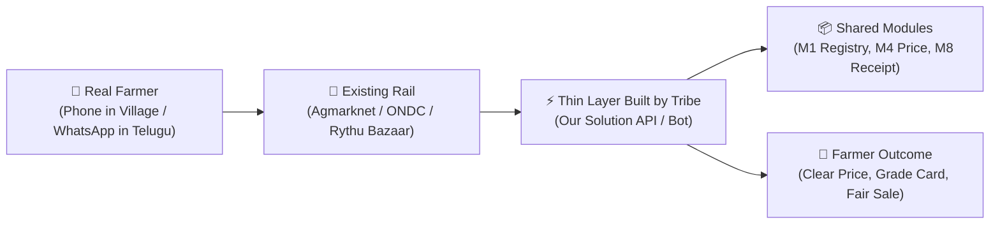

# 🌾 Agripreneurs Buildathon 01 — Solution Template

> **Theme:** *Build for the Farmer. Start in the field, not on the whiteboard.*  
> **Key Deadlines:** Code Freeze: **15 Oct 2026, 11:59 PM IST** | Commit to 5 Farmers: **16 Oct 2026** | Showcase Meet: **17 Oct 2026 at GITAM VDC, Vizag**  
> **Tribe Size:** 2–5 Members (Max 3 Speakers in Live Q&A)  
> **Judges / Collaborators (if private):** [`@agripreneurs`](https://github.com/agripreneurs) & [`@kumarraja`](https://github.com/kumarraja)

---

## 📌 Deliverable Quick Links & Submission Summary

| Deliverable | Location / URL | Status |
|-------------|----------------|--------|
| **Team / Tribe Name** | `[Your Tribe Name Here]` | Required |
| **Selected Track** | `[PS1-PS6 or Open Innovation]` | Required |
| **Working Video Demo (2-3 min)** | `[YouTube Unlisted / Loom Link]` | Required |
| **Pitch Deck (8-10 Slides)** | [`/docs/presentation.pdf`](file:///Users/laku/projects/agripreneurs-buildathon-template/docs/presentation.pdf) or `[Google Slides / Canva URL]` | Required |
| **1-Page Executive Summary** | [`/docs/executive-summary-template.md`](file:///Users/laku/projects/agripreneurs-buildathon-template/docs/executive-summary-template.md) or [`/docs/project-report.pdf`](file:///Users/laku/projects/agripreneurs-buildathon-template/docs/project-report.pdf) | Required |
| **Module / API Contract** | [`/spec/contract.json`](file:///Users/laku/projects/agripreneurs-buildathon-template/spec/contract.json) | Required |
| **Field Validation ("One Honest Number")** | Documented in Section 8 below | Required |
| **Live Deployed Prototype (Web/App)** | `[Web / Streamlit / API / APK URL or N/A]` | Optional |
| **Optional Deep Dive Report** | [`/docs/final-report-template.md`](file:///Users/laku/projects/agripreneurs-buildathon-template/docs/final-report-template.md) | *Optional* |

---

## 👥 Tribe Information

- **Tribe Name:** `[Tribe Name]`
- **College / Organization:** `[Institution Name]`
- **Primary Contact Email:** `[lead@example.com]`
- **Primary Contact WhatsApp:** `[+91-XXXXXXXXXX]`

### Team Members & Live Q&A Speakers (Max 3 Speakers)

| Member Name | Role / Tribe Specialty | GitHub Handle | Live Q&A Speaker? (Max 3) |
|-------------|------------------------|---------------|---------------------------|
| `Member 1 (Lead)` | Developer (Python / Backend) | `@github1` | **Yes (Speaker 1)** |
| `Member 2` | Hardware / IoT / Robotics | `@github2` | **Yes (Speaker 2)** |
| `Member 3` | Designer (Telugu UX Flows) | `@github3` | **Yes (Speaker 3)** |
| `Member 4` | Product / Business Analyst | `@github4` | No |
| `Member 5` | Agri Domain / Farmer Mentor | `@github5` | No |

---

## 🎯 Selected Problem Statement

- **Selected Track:** `[PS1: Daily Price Signal | PS2: Storage Booking | PS3: Grade-Assist | PS4: Crop-Photo Check | PS5: Organic Marketplace | PS6: Robotic Farming Stack | Open Innovation]`
- **Problem Statement Title:** `[Problem Title]`
- **Problem Summary (Ground Reality):**
  *(What is the real-world value leak or friction? Why does current advice or manual practice fail?)*
- **Target Beneficiaries:** *(e.g. Smallholder dry chilli farmers in Gurazala, Tomato growers in Vizag belt, FPOs)*
- *Detailed analysis available in [`docs/problem-statement.md`](file:///Users/laku/projects/agripreneurs-buildathon-template/docs/problem-statement.md).*

---

## 💡 Solution & Thin-Layer Architecture

> **The AgriPreneurs Rule:** Build the thin layer, not the whole stack. Stand on rails that already exist. Connect modules via contracts and events only.

- **Existing Rails Leveraged:** `[Agmarknet (data.gov.in) | ONDC | Digi Rythu Bazaar | WhatsApp Business | e-NAM / WDRA]`
- **AgriPreneurs Shared Modules Consumed:** `[M1 Registry | M2 Messaging | M3 Image & Inference | M4 Price Feed | M5 Advisory | M6 Listing | M8 Receipt & Ledger | M9 Traceability]`
- **Core Value Proposition:** *(What does your product do, for whom, and what is its unique advantage?)*



*See [`docs/system-architecture.md`](file:///Users/laku/projects/agripreneurs-buildathon-template/docs/system-architecture.md) for detailed architecture, and [`docs/code-and-maintenance-guide.md`](file:///Users/laku/projects/agripreneurs-buildathon-template/docs/code-and-maintenance-guide.md) for community maintenance rules.*

---

## 🛠️ Technology Stack

- **Frontend / Farmer Interface:** Vernacular Telugu flows on WhatsApp (Twilio/Meta API) / Flutter / React / Streamlit.
- **Backend & APIs:** Python 3.10+, FastAPI / Flask / Node.js.
- **Data & Feeds:** Agmarknet daily price scraper via `data.gov.in`, OpenWeather API.
- **Hardware / IoT (if applicable):** ESP32, Capacitive Soil Sensors, Relays, Solenoid valves, CNC Cartesian robot frame, ArUco markers, YOLO vision.
- **Database & State:** SQLite (zero-setup default) / PostgreSQL / Redis.
- **Testing & Specification:** Python `unittest`, JSON Schema / OpenAPI in `/spec`.

---

## 🚀 Quickstart & Zero-Setup Run

As required by the AgriPreneurs module contract, this repository runs with **zero-setup** using local sample data:

```bash
# 1. Clone repository
git clone https://github.com/[your-tribe]/[your-repo].git
cd [your-repo]

# 2. Set up virtual environment
python3 -m venv .venv
source .venv/bin/activate  # On Windows: .venv\Scripts\activate

# 3. Install dependencies
pip install -r requirements.txt

# 4. Copy environment template
cp .env.example .env

# 5. Run the prototype
python3 src/main.py
```

---

## 🧪 Testing & Validation

```bash
# Run automated test suite
python3 -m unittest discover tests
```

*See [`tests/README.md`](file:///Users/laku/projects/agripreneurs-buildathon-template/tests/README.md) for details.*

---

## 🌾 Field Validation: "One Honest Number"

*Judges evaluate prototypes by what happened in the field with real farmers.*

- **Farmers Onboarded / Tested:** `[e.g. 5 tomato farmers in Anandapuram]`
- **The One Honest Metric:** `[e.g. Grade A card fetched ₹6/kg premium over ungraded lot, or 100% agreement on top-3 pest causes]`
- **What the Farmer Said:** `"[Direct quote from farmer who held the prototype]"`
- **What Is NOT Built Yet:** `[Honest assessment of current gaps and technical roadmap]`

---

## ⚡ Hardware & Embedded (If Applicable)

- **Bill of Materials:** Located in [`hardware/bom.csv`](file:///Users/laku/projects/agripreneurs-buildathon-template/hardware/bom.csv) (Estimated cost: ~₹1,500).
- **Firmware:** Located in [`hardware/firmware/main.ino`](file:///Users/laku/projects/agripreneurs-buildathon-template/hardware/firmware/main.ino).
- **Schematics:** Located in [`hardware/schematics/`](file:///Users/laku/projects/agripreneurs-buildathon-template/hardware/schematics/).

*(If building a software-only tool or WhatsApp bot, state "Software-Only Solution" here).*

---

## 📄 Pre-Submission Checklist

Before **15 October 2026, 11:59 PM IST**:

- [ ] Zero API keys or credentials committed (`.env.example` used).
- [ ] No large ML checkpoints or massive datasets committed.
- [ ] Working prototype executes out of the box (`python3 src/main.py`).
- [ ] Unit tests pass (`python3 -m unittest discover tests`).
- [ ] Published contract in [`/spec`](file:///Users/laku/projects/agripreneurs-buildathon-template/spec/README.md).
- [ ] 2–3 minute video demo recorded (YouTube unlisted / Loom).
- [ ] Pitch deck saved as [`docs/presentation.pdf`](file:///Users/laku/projects/agripreneurs-buildathon-template/docs/presentation.pdf) or accessible cloud URL.
- [ ] 1-page executive summary completed in [`docs/executive-summary-template.md`](file:///Users/laku/projects/agripreneurs-buildathon-template/docs/executive-summary-template.md).
- [ ] Tested with real farmers and "One Honest Number" documented above.
- [ ] If private, collaborators [`@agripreneurs`](https://github.com/agripreneurs) and [`@kumarraja`](https://github.com/kumarraja) added.
- [ ] Final text/URL-based submission form submitted on time.

---

## 📜 License

Licensed under the [MIT License](file:///Users/laku/projects/agripreneurs-buildathon-template/LICENSE).