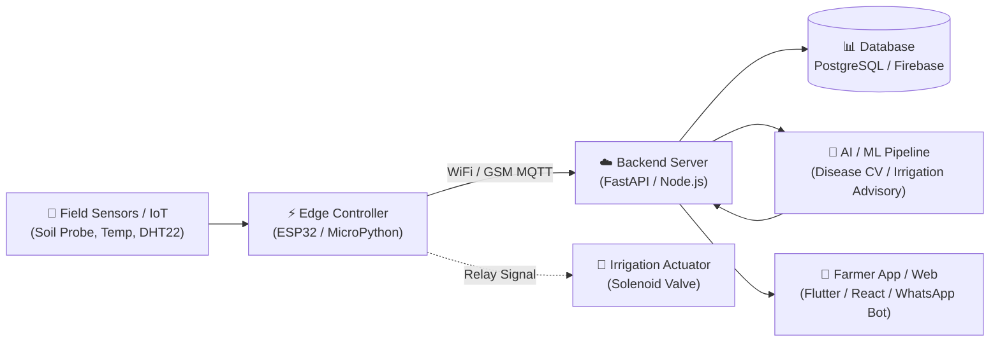

# 🌾 Agripreneurs Buildathon 01 — Project Template

> **Official Solution Repository & Documentation**  
> **Deadline:** 15 October 2026, 11:59 PM IST | **Team Size:** 2–5 Members (Max 3 Speakers in Live Q&A)  
> **Judges / Collaborators (if private):** [`@agripreneurs`](https://github.com/agripreneurs) & [`@kumarraja`](https://github.com/kumarraja)

---

## 📌 Project Quick Links & Submission Summary

| Deliverable | Location / URL | Status |
|-------------|----------------|--------|
| **Team Name** | `[Your Team Name Here]` | Required |
| **Selected Track** | `[PS1-PS6 or Open Innovation]` | Required |
| **Pitch Deck (Slides)** | [`/docs/presentation.pdf`](file:///Users/laku/projects/agripreneurs-buildathon-template/docs/presentation.pdf) or `[Google Slides / Canva URL]` | Required |
| **Video Demo (2-3 min)** | `[YouTube Unlisted / Loom Link]` | Required |
| **Live Deployed Prototype** | `[Web / Streamlit / API URL or N/A]` | Optional |
| **Executive Summary (1-Page)**| [`/docs/executive-summary-template.md`](file:///Users/laku/projects/agripreneurs-buildathon-template/docs/executive-summary-template.md) or [`/docs/project-report.pdf`](file:///Users/laku/projects/agripreneurs-buildathon-template/docs/project-report.pdf) | Required |
| **Optional Deep Dive Report** | [`/docs/final-report-template.md`](file:///Users/laku/projects/agripreneurs-buildathon-template/docs/final-report-template.md) | *Optional* |

---

## 👥 Team Information

- **Team Name:** `[Team Name]`
- **College / Institution:** `[College / University / Organization]`
- **Primary Contact Email:** `[team_lead@example.com]`
- **Primary Contact Phone / WhatsApp:** `[+91-XXXXXXXXXX]`

### Team Members & Live Q&A Speakers
*Note: Recommended team size is 2–5 members. A maximum of 3 speakers are permitted during the live Q&A session.*

| Member Name | Role / Specialty | GitHub Handle | Live Q&A Speaker? (Max 3) |
|-------------|------------------|---------------|---------------------------|
| `Member 1 (Lead)` | Software / Backend | `@username1` | **Yes (Speaker 1)** |
| `Member 2` | Hardware / IoT / Embedded | `@username2` | **Yes (Speaker 2)** |
| `Member 3` | AI / ML / Computer Vision | `@username3` | **Yes (Speaker 3)** |
| `Member 4` | UI/UX / Mobile App | `@username4` | No |
| `Member 5` | Agri Domain & Field Research | `@username5` | No |

---

## 🎯 Selected Problem Statement

- **Track Selected:** `[PS1 | PS2 | PS3 | PS4 | PS5 | PS6 | Open Innovation]`
- **Official Problem Title:** `[Problem Title or Custom Title]`
- **Agricultural Problem Summary:**
  *(Describe the real-world agricultural challenge in 2–3 sentences: What are farmers suffering from, why does it happen, and what is the economic or environmental loss?)*
- **Target Beneficiaries:** *(e.g. Smallholder paddy farmers with <2 hectares in semi-arid zones)*
- *For a deeper breakdown, see [`docs/problem-statement.md`](file:///Users/laku/projects/agripreneurs-buildathon-template/docs/problem-statement.md).*

---

## 💡 Proposed Solution & Innovation

- **Solution Headline:** *(A single compelling sentence explaining what your product does)*
- **Core Value Proposition:**
  *(How does your solution resolve the bottleneck? What makes it better, faster, or significantly cheaper than existing market solutions?)*
- **Key Features:**
  - 🌟 **Feature 1:** `[Description]`
  - 🌟 **Feature 2:** `[Description]`
  - 🌟 **Feature 3:** `[Description]`
  - 🌟 **Feature 4:** `[Description]`
- *For full workflow, see [`docs/solution-overview.md`](file:///Users/laku/projects/agripreneurs-buildathon-template/docs/solution-overview.md).*

---

## 🏗️ System Architecture & Data Flow



*See [`docs/system-architecture.md`](file:///Users/laku/projects/agripreneurs-buildathon-template/docs/system-architecture.md) for detailed component tables, security models, and design trade-offs.*

---

## 🛠️ Technology Stack

- **Hardware & IoT:** ESP32 DevKit, Capacitive Soil Moisture Sensor v1.2, DS18B20 Temp Probe, 12V Solenoid Valve, 5V Relay Module.
- **Embedded Firmware:** C++ (Arduino IDE / PlatformIO) or MicroPython.
- **Backend / APIs:** Python 3.11, FastAPI / Flask, MQTT Broker (HiveMQ / Mosquitto).
- **Machine Learning / Analytics:** PyTorch / TensorFlow Lite / Scikit-learn / OpenCV.
- **Frontend / Client:** Streamlit / Flutter / React / Tailwind CSS.
- **Cloud & DevOps:** GitHub Actions, Docker, Render / Railway / Vercel.

---

## ⚡ Hardware & Field Implementation (If Applicable)

- **Hardware Specs & Wiring:** See [`hardware/README.md`](file:///Users/laku/projects/agripreneurs-buildathon-template/hardware/README.md).
- **Bill of Materials (BOM):** See [`hardware/bom.csv`](file:///Users/laku/projects/agripreneurs-buildathon-template/hardware/bom.csv) (Total prototype cost: ~₹1,500).
- **Firmware Code:** Located in [`hardware/firmware/main.ino`](file:///Users/laku/projects/agripreneurs-buildathon-template/hardware/firmware/main.ino).
- **Circuit Schematics & Photos:** Located in [`hardware/schematics/`](file:///Users/laku/projects/agripreneurs-buildathon-template/hardware/schematics/).

*(If your project is software-only, write "Software-Only Solution" here).*

---

## 🚀 Setup & Installation Guide

Follow these steps to run the software prototype locally:

### 1. Prerequisites
- Python 3.10+ (or Node.js 18+ if applicable)
- Git installed
- (Optional) Arduino IDE or VS Code PlatformIO if flashing hardware

### 2. Clone the Repository
```bash
git clone https://github.com/[your-team]/[your-repo].git
cd [your-repo]
```

### 3. Set Up Virtual Environment & Dependencies
```bash
# Create and activate virtual environment
python3 -m venv .venv
source .venv/bin/activate  # On Windows: .venv\Scripts\activate

# Install dependencies
pip install -r requirements.txt
```

### 4. Configure Environment Variables
```bash
# Copy example configuration (DO NOT commit real keys!)
cp .env.example .env

# Edit .env with your local settings/API keys if needed
```

### 5. Run the Prototype
```bash
# Run the starter solution script
python src/main.py
```

---

## 🧪 Testing & Validation

Judges look for automated tests and validation proof. Run our built-in test suite:

```bash
# Run standard unittests
python3 -m unittest discover tests

# Or run with pytest (if installed)
pytest tests/ -v
```

Validation highlights:
- `test_project_root_exists`: Confirms repo sanity.
- `test_load_sample_sensor_data`: Verifies field telemetry schema.
- `test_irrigation_evaluation_*`: Tests threshold boundary conditions and decision safety.

*See [`tests/README.md`](file:///Users/laku/projects/agripreneurs-buildathon-template/tests/README.md) for instructions on adding tests.*

---

## 💰 Unit Economics & Farmer Viability

- **Prototype Unit Cost:** ~₹1,500 ($18 USD)
- **Estimated Mass Production Cost (1,000 units):** ~₹850 ($10 USD)
- **Expected Farmer Benefits:**
  - Water savings: 25–35% reduction in groundwater extraction.
  - Energy savings: ~15% reduction in electricity/diesel pump operating hours.
  - Payback period: ~4–6 months on a 2-acre plot.

---

## 🗺️ Roadmap & Next Steps

- [ ] **Phase 1 (Buildathon):** Functional edge prototype, sensor calibration, local rule engine, and cloud API.
- [ ] **Phase 2 (Field Pilot - 30 Days):** Deploy 5 pilot units across local partner farms; validate sensor drift in monsoon soil.
- [ ] **Phase 3 (Productization - 90 Days):** Custom PCB design to cut costs by 40%, IP67 waterproof enclosure, and vernacular voicebot (Hindi/Tamil/Telugu).

---

## 📄 Submission Verification Checklist

Before submitting on **15 October 2026, 11:59 PM IST**:

- [ ] Repository has no hardcoded credentials or API keys (`.env` is in `.gitignore`).
- [ ] Large ML models and raw data archives are not committed (links provided if needed).
- [ ] Working prototype can be executed via instructions in this README.
- [ ] Unit tests pass cleanly (`python3 -m unittest discover tests`).
- [ ] Presentation slides hosted in [`docs/presentation.pdf`](file:///Users/laku/projects/agripreneurs-buildathon-template/docs/presentation.pdf) or cloud URL verified.
- [ ] 2–3 minute video demo recorded and link added above.
- [ ] 1-page executive summary completed in [`docs/executive-summary-template.md`](file:///Users/laku/projects/agripreneurs-buildathon-template/docs/executive-summary-template.md) or [`docs/project-report.pdf`](file:///Users/laku/projects/agripreneurs-buildathon-template/docs/project-report.pdf).
- [ ] If repository is private, collaborators [`@agripreneurs`](https://github.com/agripreneurs) and [`@kumarraja`](https://github.com/kumarraja) are invited.
- [ ] Purely text/URL-based submission form submitted on time.

---

## 📜 License

This project is licensed under the MIT License - see the [`LICENSE`](file:///Users/laku/projects/agripreneurs-buildathon-template/LICENSE) file for details.