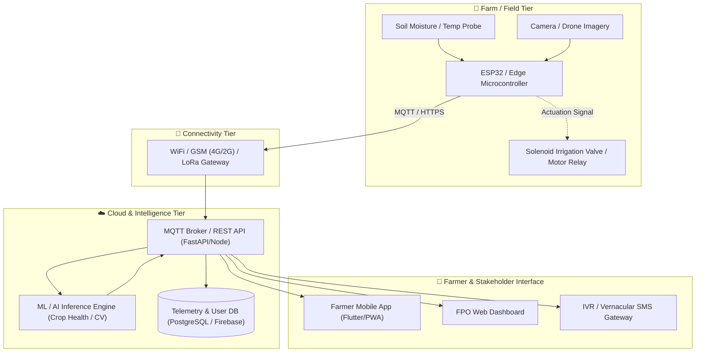

# System Architecture

Provide a technical breakdown of your solution's components, data flows, and design rationale.

---

## 1. High-Level Architecture Diagram

You can use the GitHub Mermaid diagram below as a starting point. Edit the nodes to reflect your exact hardware and software stack:

---

## 2. Component Breakdown

| Tier | Component / Module | Technology / Hardware | Responsibility |
|------|--------------------|-----------------------|----------------|
| **Field** | Edge Controller | ESP32 DevKit V1 | Reads sensor ADC, handles local thresholds, controls relays |
| **Field** | Sensing Unit | Capacitive Probe + NPK | Measures soil health parameters |
| **Network** | Connectivity | GSM SIM800L / WiFi | Transmits telemetry via secure MQTT payload |
| **Backend** | API Gateway | Python FastAPI / Node.js | Ingestion endpoint, authentication, data persistence |
| **AI / ML** | Vision / Analytics | PyTorch / TFLite / Scikit | Classifies crop disease or predicts irrigation schedule |
| **Frontend**| Farmer App | Flutter / React / Streamlit | Displays advisory, manual override, multilingual support |

---

## 3. Data Flow & Security
1. **Telemetry Ingest:** Sensors sample every *N* minutes; data is serialized into JSON / CBOR.
2. **Offline Queuing:** If network connectivity drops, edge device buffers logs in SPIFFS/SD card and retries with exponential backoff.
3. **Security:** Device authentication using token/pre-shared keys; no hardcoded API keys in source code (configured via `.env`).
4. **Actuation Safety:** Failsafe timeout triggers to shut off water pumps automatically if network heartbeat is lost.

---

## 4. Technical Trade-offs & Design Rationale
- **Why this architecture over alternatives?** (e.g., Why edge processing vs. 100% cloud inference? Why capacitive sensor over resistive?)
- **Scalability:** How will this handle 1,000 sensors or farms simultaneously?